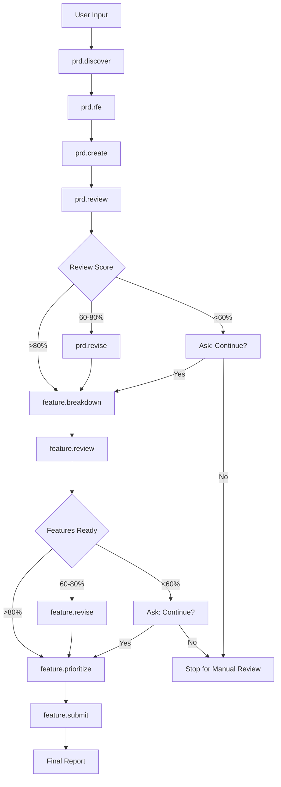

## User Input

```text
$ARGUMENTS
```

You **MUST** consider the user input before proceeding (if not empty). The user input should contain the initial product idea or problem statement.

## Outline

This command automates the entire PRD-Feature workflow from discovery through Jira submission. It runs each phase sequentially, making intelligent decisions and only pausing to ask simplified, critical questions when absolutely necessary.

**Workflow Phases (in order)**:
1. `/prd.discover` - Product discovery
2. `/prd.rfe` - RFE gathering
3. `/prd.create` - PRD creation
4. `/prd.review` - PRD review
5. `/prd.revise` - PRD revision (if needed, based on review)
6. `/feature.breakdown` - Feature breakdown
7. `/feature.review` - Feature review
8. `/feature.revise` - Feature revision (if needed, based on review)
9. `/feature.prioritize` - Feature prioritization
10. `/feature.submit` - Feature submission to Jira

## Execution Strategy

### Phase 1: Discovery (`/prd.discover`)

1. **Execute Discovery**:
   - Run the discovery phase using the user's initial input
   - Invoke collaborating agents: @parker-product_manager.md, @ryan-ux_researcher.md, @aria-ux_architect.md
   - Generate `discovery.md`
   - Make reasonable assumptions when information is missing
   - Only ask questions if critical information is completely absent

2. **Critical Questions (only if needed)**:
   - "Who are the primary users?" (if not inferable from context)
   - "What is the main problem being solved?" (if not clear from input)
   - Maximum 2-3 questions total

3. **Proceed automatically** to RFE phase

### Phase 2: RFE (`/prd.rfe`)

1. **Execute Requirements Gathering**:
   - Transform discovery insights into specific requirements
   - Invoke collaborating agents: @parker-product_manager.md, @ryan-ux_researcher.md, @olivia-product_owner.md, @aria-ux_architect.md
   - Generate `rfe.md`
   - Use MoSCoW prioritization by default
   - Make intelligent assumptions about requirement priorities

2. **No questions** - proceed automatically to PRD creation

### Phase 3: PRD Creation (`/prd.create`)

1. **Execute PRD Creation**:
   - Create comprehensive PRD from requirements
   - Invoke collaborating agents: @parker-product_manager.md, @ryan-ux_researcher.md, @terry-technical_writer.md, @casey-content_strategist.md
   - Generate `prd.md` and `prd-checklist.md`
   - Include all standard sections: Executive Summary, Goals, User Stories, Requirements, Success Metrics

2. **No questions** - proceed automatically to PRD review

### Phase 4: PRD Review (`/prd.review`)

1. **Execute PRD Review**:
   - Review PRD for completeness and quality
   - Invoke collaborating agents: @steve-ux_designer.md, @aria-ux_architect.md, @olivia-product_owner.md, @archie-architect.md
   - Generate `prd-review-report.md`
   - Identify areas needing improvement

2. **Automatic Decision Making**:
   - If review score > 80%: proceed to Feature breakdown
   - If review score 60-80%: run `/prd.revise` once, then proceed
   - If review score < 60%: ask user if they want to continue or stop for manual revision

### Phase 5: PRD Revision (`/prd.revise`) - Conditional

1. **Execute if Needed**:
   - Only run if review score was 60-80%
   - Address major gaps identified in review
   - Invoke collaborating agents: @parker-product_manager.md, @terry-technical_writer.md
   - Update `prd.md`

2. **No questions** - proceed automatically to Feature breakdown

### Phase 6: Feature Breakdown (`/feature.breakdown`)

1. **Execute Feature Breakdown**:
   - Break PRD into discrete Feature items
   - Invoke collaborating agents: @olivia-product_owner.md, @stella-staff_engineer.md, @archie-architect.md, @neil-test_engineer.md
   - Generate `features.md` and individual Feature files in `feature-tasks/`
   - Apply intelligent sizing (S/M/L/XL) based on complexity

2. **Automatic Decision Making**:
   - Target 5-12 Features total (break down further if > 12, combine if < 5)
   - Ensure each Feature is independently deliverable
   - Automatically identify dependencies

3. **No questions** - proceed automatically to Feature review

### Phase 7: Feature Review (`/feature.review`)

1. **Execute Feature Review**:
   - Review Features for technical feasibility
   - Invoke collaborating agents: @stella-staff_engineer.md, @archie-architect.md, @neil-test_engineer.md, @emma-engineering_manager.md, @olivia-product_owner.md
   - Generate `feature-review-report.md`
   - Assess technical risks and implementation readiness

2. **Automatic Decision Making**:
   - If > 80% of Features are "Ready": proceed to prioritization
   - If 60-80% of Features are "Ready": run `/feature.revise` on problematic Features, then proceed
   - If < 60% of Features are "Ready": ask user if they want to continue or stop for manual review

### Phase 8: Feature Revision (`/feature.revise`) - Conditional

1. **Execute if Needed**:
   - Only run if 60-80% of Features were "Ready" in review
   - Focus on Features marked as "Needs Work"
   - Invoke collaborating agents: @olivia-product_owner.md, @stella-staff_engineer.md, @neil-test_engineer.md
   - Update individual Feature files in `feature-tasks/`

2. **No questions** - proceed automatically to Feature prioritization

### Phase 9: Feature Prioritization (`/feature.prioritize`)

1. **Execute Feature Prioritization**:
   - Apply RICE scoring by default (use reasonable assumptions for missing data)
   - Invoke collaborating agents: @parker-product_manager.md, @olivia-product_owner.md, @emma-engineering_manager.md
   - Generate `prioritization.md` and optional `roadmap-visual.md`
   - Create 3-phase roadmap by default

2. **Intelligent Assumptions**:
   - **Reach**: Estimate based on user base described in PRD
   - **Impact**: High=3, Medium=2, Low=1 based on business goals
   - **Confidence**: 80% default for well-defined Features, 50% for uncertain ones
   - **Effort**: Use size estimates from Feature breakdown

3. **No questions** - proceed automatically to Feature submission

### Phase 10: Feature Submission (`/feature.submit`)

1. **Execute Feature Submission**:
   - Format Features for Jira submission
   - Invoke collaborating agents: @olivia-product_owner.md, @emma-engineering_manager.md, @parker-product_manager.md
   - Generate `jira-tickets.md` (or submission instructions if no Jira MCP)
   - If Jira MCP available: automatically create tickets
   - If no Jira MCP: provide detailed manual instructions

2. **Final Report**:
   - Summarize entire workflow results
   - Provide links to all generated artifacts
   - Include next steps for implementation

## Speedrun Guidelines

### Minimize Questions
- **Maximum 5 questions total** across the entire workflow
- Only ask when critical information is completely missing
- Prefer making intelligent assumptions over asking questions
- Group related questions together when possible

### Make Intelligent Assumptions
- **User personas**: Infer from problem description
- **Market size**: Use industry standards or reasonable estimates
- **Technical approach**: Choose standard/proven patterns
- **Priorities**: Align with common business goals (revenue, user satisfaction, efficiency)
- **Effort estimates**: Use pattern recognition from similar features

### Error Recovery
- If a phase fails, try once more with adjusted parameters
- If still failing, ask user whether to continue or stop
- Always prefer partial completion over total failure

### Quality vs. Speed Balance
- Aim for 80% quality - good enough for most use cases
- Focus on completeness over perfection
- Ensure all required artifacts are generated
- Identify major gaps that need human review

## Execution Flow



## Success Criteria

- All 10 workflow phases complete successfully
- All required artifacts generated (discovery.md, rfe.md, prd.md, features.md, feature-tasks/, prioritization.md)
- Features are ready for implementation or have clear next steps
- User has actionable roadmap for proceeding
- Total execution takes 30-60 minutes for most projects

## Final Deliverables

Upon completion, the user receives:
- **Complete PRD** (`prd.md`) with business case and requirements
- **Feature Master List** (`features.md`) with breakdown and effort estimates
- **Individual Feature Documents** (`feature-tasks/*.md`) ready for development
- **Prioritized Roadmap** (`prioritization.md`) with implementation phases
- **Jira Integration** (`jira-tickets.md`) for ticket creation or manual instructions
- **Summary Report** with next steps and recommendations

This enables immediate transition from idea to implementation planning without manual workflow orchestration.