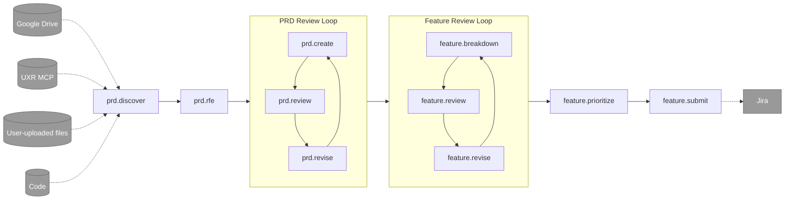

# Create PRDs & Features

A comprehensive workflow for creating Product Requirements Documents (PRDs) and systematically breaking them down into actionable Feature items.

This workflow is deisned to be run on [Ambient Code Platform](https://github.com/ambient-code/platform).

## Who this is for

**Product Managers** who want to leverage agents in the creation of comprehensive, well-defined, data-informed PRDs and Features. The goal is to generate PRDs and Features that are more likely to be accepted by a Senior Engineer or Architect for implementation.

## Workflow

The creation of a PRD and subsequent refinements of Features associated with that PRD follow a general workflow that starts with discovery, goes through two refinement loops, and utimately exports Feature definitions to Jira.

### Slash Commands

The workflow is accessible through slash commands which enable the user to keep the agents on track. Some commands have prerequisites. For example `/feature.breakdown` which breaks a PRD down into Features, requires the existance of a PRD document.

**Quick Start**: Use `/feature.speedrun` to automatically run the entire workflow from discovery to Jira submission, only pausing for critical questions.

**Individual Commands**:

1. [`prd.discover`](#1-prddiscover) - Product discovery
2. [`prd.rfe`](#2-prdrfe) - Define precise requirements
3. [`prd.create`](#3-prdcreate) - Draft or update PRD
4. [`prd.review`](#4-prdreview) - PRD review by senior engineer and architect agents.
5. [`prd.revise`](#5-prdrevise) - Revise PRD based on feedback or new data
6. [`feature.breakdown`](#6-featurebreakdown) - Breakdown a PRD into scoped Features
7. [`feature.review`](#7-featurereview) - Individual Feature review by senior engineer and architect agents.
8. [`feature.revise`](#8-featurerevise) - Feature Revision
9. [`feature.prioritize`](#9-featureprioritize) - Prioritize Features and create implementation roadmap
10. [`feature.submit`](#10-featuresubmit) - Feature formatting and submission to Jira

**Meta-Commands**:

- [`feature.speedrun`](#featurespeedrun) - Automatically run the complete workflow from discovery to Jira submission, only pausing for critical questions
- [`prd.sources`](#prdsources) - List all data sources that informed the PRD creation, including documents, code references, research, and external sources

---

### 1. `prd.discover`
**Purpose**: Product discovery

**Data Connections**:
- **Google Drive** - Access to user's product documents, stakeholder notes, and related assets.
- **UXR MCP** - Aggregates and provides structured access to all available user research reports, findings, and actionable insights relevant to the problem space.
- **User-uploaded files** - Allows team members to directly upload supporting materials.
- **Code** - Access to relevant code repositories.

**Collaborating Agents**:
- **@parker-product_manager.md** - Market strategy, competitive analysis, opportunity quantification
- **@ryan-ux_researcher.md** - User insights from research studies, evidence-based requirements (CRITICAL: grounds requirements in available research from "All UXR Reports" folder)
- **@aria-ux_architect.md** (bullpen) - User journey mapping, ecosystem-level UX strategy

**Key Actions**:
- Define problem statement and business goals
- Collect source materials such as notes and links to related code repositories
- Research user pain points with data from existing studies
- Analyze competitive landscape and market opportunity
- Document assumptions and success metrics

**Artifacts Created**:
- `artifacts/discovery.md` - Product discovery document with problem statement, user research, market analysis, and proposed solutions

---

### 2. `prd.rfe`
**Purpose**: Define precise requirements

**Collaborating Agents**:
- **@parker-product_manager.md** - Business requirements, success criteria, constraints, and prioritization
- **@ryan-ux_researcher.md** - User requirements grounded in research studies, user stories with evidence
- **@olivia-product_owner.md** (bullpen) - User story structure, acceptance criteria definition, requirement prioritization (MoSCoW)
- **@aria-ux_architect.md** (bullpen) - User flows, information architecture considerations

**Key Actions**:
- Transform discovery insights into specific, testable requirements
- Write user stories with clear acceptance criteria
- Define functional and non-functional requirements
- Prioritize requirements using MoSCoW method
- Document constraints, dependencies, and assumptions
- Clearly define scope and out-of-scope items

**Artifacts Created**:
- `artifacts/rfe.md` - Detailed product requirements document with business requirements, user stories, functional and non-functional requirements

---

### 3. `prd.create`
**Purpose**: Draft or update PRD

**Collaborating Agents**:
- **@parker-product_manager.md** - Business requirements, value proposition, ROI justification
- **@ryan-ux_researcher.md** - Research-informed requirements with citations from studies
- **@terry-technical_writer.md** - Documentation quality, clarity, and structure
- **@casey-content_strategist.md** (bullpen) - Content architecture and standards

**Key Actions**:
- Write executive summary and product vision
- Document goals, success metrics, and KPIs
- Define user stories with research backing
- Specify functional and non-functional requirements

**Artifacts Created**:
- `artifacts/prd.md` - Comprehensive Product Requirements Document
- `artifacts/prd-checklist.md` - PRD quality checklist for validation

---

### 4. `prd.review`
**Purpose**: PRD review by senior engineer and architect agents.

**Collaborating Agents**:
- **@steve-ux_designer.md** - UX assessment, determine if prototype needed for validation
- **@aria-ux_architect.md** (bullpen) - Holistic UX strategy validation, journey alignment
- **@olivia-product_owner.md** (bullpen) - Story readiness, acceptance criteria validation
- **@archie-architect.md** (bullpen) - Technical feasibility, architecture alignment

**Key Actions**:
- Validate requirements are clear and testable
- Assess if prototype is needed for user validation
- Check technical feasibility and architecture fit
- Ensure documentation meets quality standards

**Artifacts Created**:
- `artifacts/prd-review-report.md` - PRD completeness review report with quality assessment and recommendations

---

### 5. `prd.revise`
**Purpose**: Revise PRD based on feedback or new data

**Collaborating Agents**:
- **@parker-product_manager.md** - Business value adjustments, strategic refinements
- **@terry-technical_writer.md** - Clarity improvements, documentation structure

**Key Actions**:
- Address review feedback and gaps
- Strengthen requirements with additional research
- Improve clarity and structure
- Validate all acceptance criteria are testable

**Artifacts Created**:
- Updates to `artifacts/prd.md` - Revised PRD based on review feedback

---

### 6. `feature.breakdown`
**Purpose**: Breakdown a PRD into scoped Features

**Collaborating Agents**:
- **@olivia-product_owner.md** (bullpen) - Backlog management, story decomposition, acceptance criteria
- **@stella-staff_engineer.md** - Technical scoping, effort estimation, complexity assessment
- **@archie-architect.md** (bullpen) - System design, dependencies, architectural coordination
- **@neil-test_engineer.md** (bullpen) - Testability assessment, automation requirements, cross-component impact

**Key Actions**:
- Decompose PRD into implementable Features
- Define clear acceptance criteria for each Feature
- Identify technical dependencies and risks
- Size Features and assess testing requirements

**Artifacts Created**:
- `artifacts/features.md` - Feature master list with overview, summary, and detailed Feature descriptions
- `artifacts/feature-tasks/` - Directory containing individual Feature files
  - `Feature-001-[slug].md`, `Feature-002-[slug].md`, etc. - Individual Feature documents following Red Hat Feature format

---

### 7. `feature.review`
**Purpose**: Individual Feature review by senior engineer and architect agents.

**Collaborating Agents**:
- **@stella-staff_engineer.md** - Technical feasibility, implementation complexity, risk assessment
- **@archie-architect.md** (bullpen) - Architecture alignment, system-level implications
- **@neil-test_engineer.md** (bullpen) - Testing requirements, automation strategy, cross-team impact
- **@emma-engineering_manager.md** (bullpen) - Team capacity planning, delivery coordination
- **@olivia-product_owner.md** (bullpen) - Acceptance criteria validation, scope negotiation

**Key Actions**:
- Validate technical approach and feasibility
- Assess testability and automation requirements
- Check team capacity and delivery timeline
- Ensure architecture alignment

**Artifacts Created**:
- Feature review feedback and recommendations (may update individual Feature files in `artifacts/feature-tasks/`)

---

### 8. `feature.revise`
**Purpose**: Feature Revision

**Collaborating Agents**:
- **@olivia-product_owner.md** (bullpen) - Story refinement, scope adjustments
- **@stella-staff_engineer.md** - Technical design adjustments, complexity reduction
- **@neil-test_engineer.md** (bullpen) - Test requirements clarification, testability improvements

**Key Actions**:
- Address technical concerns and risks
- Refine acceptance criteria for clarity
- Adjust scope based on capacity constraints
- Enhance testability of requirements

**Artifacts Created**:
- Updates to individual Feature files in `artifacts/feature-tasks/` - Revised Features based on review feedback

---

### 9. `feature.prioritize`
**Purpose**: Prioritize Features using various frameworks and create an implementation roadmap

**Collaborating Agents**:
- **@parker-product_manager.md** - RICE scoring, business value assessment, ROI analysis, market strategy alignment
- **@olivia-product_owner.md** (bullpen) - Backlog prioritization, MoSCoW categorization, value vs effort analysis
- **@emma-engineering_manager.md** (bullpen) - Team capacity considerations, resource constraints, delivery timeline planning

**Key Actions**:
- Apply prioritization frameworks (MoSCoW, RICE, Value vs Effort, Kano Model)
- Score and rank Features based on business value and user impact
- Create implementation roadmap with phases/releases
- Define dependency-driven sequence
- Perform risk-adjusted prioritization
- Map Features to business goals and user needs
- Generate recommendations for implementation order

**Artifacts Created**:
- `artifacts/prioritization.md` - Prioritization analysis and implementation roadmap
- `artifacts/roadmap-visual.md` - Visual roadmap (optional)

---

### 10. `feature.submit`
**Purpose**: Feature formatting and submission to Jira

**Data Connections**:
- **Jira MCP** - When available, automatically creates Jira tickets from Feature files with proper field mapping, dependencies, and attachments

**Collaborating Agents**:
- **@olivia-product_owner.md** (bullpen) - Backlog prioritization, sprint planning, ticket structure
- **@emma-engineering_manager.md** (bullpen) - Team assignment, capacity allocation, delivery coordination
- **@parker-product_manager.md** - Roadmap alignment, stakeholder communication

**Key Actions**:
- **If Jira MCP available**: Automatically create Jira tickets from Feature files
  - Map Feature fields to Jira fields (title, description, priority, acceptance criteria)
  - Link dependent tickets
  - Attach Feature markdown files
  - Create ticket mapping document
- **If Jira MCP not available**: Provide manual submission instructions
  - Direct users to `artifacts/feature-tasks/` directory
  - Provide step-by-step instructions for creating tickets
  - Include field mapping guidance
- Prioritize Features in backlog
- Assign to appropriate teams
- Align with product roadmap

**Artifacts Created**:
- `artifacts/jira-tickets.md` - Jira ticket mapping document with Feature ID to Jira ticket key mappings (when Jira MCP is available)

## Quick Start
todo: add quickstart

### Prerequisites
todo: add prerequisites

## Customization

todo: add customization instructions

## Contributing

Found issues with the workflow or have improvements?

- **Report issues**: [ambient-workflows issues](https://github.com/ambient-code/ambient-workflows/issues)
- **Suggest improvements**: Create a PR with your enhancements
- **Share learnings**: Document what worked well for your team

## License

This workflow is part of the Ambient Code Platform Workflows collection.

## Support

- **Documentation**: See [Ambient Code Platform docs](https://ambient-code.github.io/platform/)
- **Issues**: [File a bug](https://github.com/ambient-code/ambient-workflows/issues)
- **Questions**: Ask in the ACP community channels

---

**Happy Product Planning! 📋→🚀**